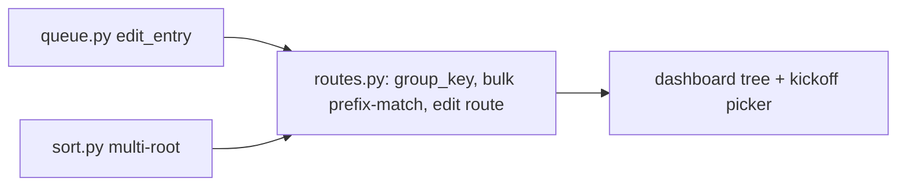

# Horizontal Plan: guided-sort-and-cluster

## Layers touched

| Layer | Files | Change |
|---|---|---|
| **Data/schema** | `src/cleanup_tools/queue.py` | New `edit_entry()` primitive (change a pending entry's proposed `dest`/`group_key`, same locking/status_history discipline as `set_status`). `group_key` format convention changes (no field/schema change — still a plain string). |
| **Command** | `src/cleanup_tools/commands/sort.py` | Extend `run()`/`_plan()`/`_run_from_queue()` to accept multiple roots via `Config.search_roots`, matching `reclaim.py`/`corral_screenshots.py`'s already-working `_resolve_roots`-style pattern. |
| **Command (reference only, no change)** | `commands/reclaim.py`, `commands/corral_screenshots.py` | Already `search_roots`-aware — used as the pattern to copy into `sort.py`, not modified themselves. |
| **Backend/API** | `src/cleanup_tools/ui/routes.py` | `_stage_sort_plan`/`_stage_reclaim_plan`/`_stage_corral_screenshots_plan` embed a location segment into `group_key`. `_bulk_target_ids` gains prefix-aware resolution. New `POST /queue/<id>/edit` route wired to `queue.edit_entry`. `/plan/*` routes accept an optional roots/locations parameter (defaulting to today's single-default behavior when omitted, so existing callers/tests are unaffected). |
| **UI** | `src/cleanup_tools/ui/templates/dashboard.html`, `base.html` (kickoff bar), new/extended static JS | Collapsible tree grouped by location → bucket; location multi-select added to the existing kickoff bar. |

## Cross-layer dependencies

Schema and command-layer work are independent of each other (no shared files) and can proceed in parallel; both must land before the API layer changes that depend on them; UI depends on the API layer being real and tested, not a paper design.

## Risk concentration

The overwhelming majority of this epic's real risk (per the design discussion and grill record) sits in the schema/command layer — `sort.py`'s multi-root extension and the `group_key` parsing table — not the UI layer, which is comparatively mechanical once its backend is solid. This is why the vertical plan puts both schema-adjacent slices before the UI slice, rather than building UI against a moving/unproven backend.
