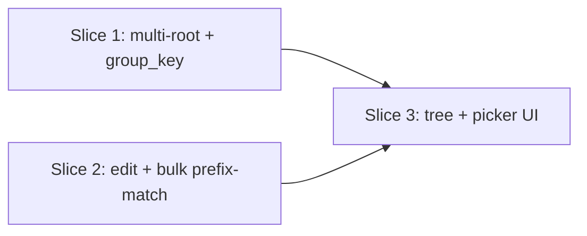

# Vertical Plan: guided-sort-and-cluster

Three slices, each landing the app in a genuinely working (test-verifiable) state before the next begins.

## Slice 1 — Multi-root sort + location-aware group_key

**What ships:** `sort.py` scans multiple roots (matching `reclaim`/`corral_screenshots`'s existing `search_roots` pattern); every staging function in `routes.py` embeds a location segment into `group_key` (fixed enum was rejected by the product owner — location is whichever of the user's configured/selected roots an entry's `src` falls under, `"other"` fallback for anything outside all of them); old-format `group_key`s parse defensively (no crash) per the design discussion's format table. Existing tree-free UI keeps working unchanged throughout — this slice is invisible to a user clicking around, but is exercised end-to-end via `cleanup sort` (now multi-root) and the existing `/plan/sort` route.

**Working-state proof:** `cleanup sort` run against multiple configured `search_roots` produces correctly-tagged queue entries; `pytest` covers old-format parsing against synthetic fixtures built from every format the research brief confirmed exists today.

## Slice 2 — Entry-level control (edit, bulk reject/undo parity)

**What ships:** `queue.edit_entry()` (new primitive — change a pending entry's proposed `dest`/`group_key`, auditable via `status_history` like every other mutation); `POST /queue/<id>/edit` route; `_bulk_target_ids` extended with prefix-aware matching so bulk reject/undo can target a location/bucket branch, not just an exact `group_key` (today's exact-match bulk-approve/reject/undo keeps working unchanged — this is additive).

**Working-state proof:** route-level tests hit `/queue/<id>/edit` and prefix-scoped bulk reject/undo directly (no UI needed yet to verify correctness — matches this project's existing pattern of testing `routes.py` via Flask's test client before/independent of UI polish).

## Slice 3 — Dashboard tree + kickoff-bar location picker

**What ships:** the collapsible tree view (location → bucket, aggregate counts/sizes only, "Other" branch always present, per-branch approve/reject/undo-all wired to slice 2's prefix-aware bulk endpoints) and a location multi-select added to the existing kickoff bar (wired to slice 1's now-multi-root `/plan/*` routes) — the two product-owner-facing payoffs ("select a subset and go," "approve Downloads/Desktop as a whole") both land here, built on two already-real, already-tested backend slices.

**Working-state proof:** this is the epic's full user-visible payoff — manual click-through plus `test_ui_routes.py` coverage of the new tree-rendering route and kickoff-bar location parameter.

## Dependency graph

Slices 1 and 2 touch disjoint files (`sort.py`+`routes.py` staging functions vs. `queue.py`+`routes.py` bulk/edit routes respectively) and can be built in parallel; slice 3 needs both finished.
