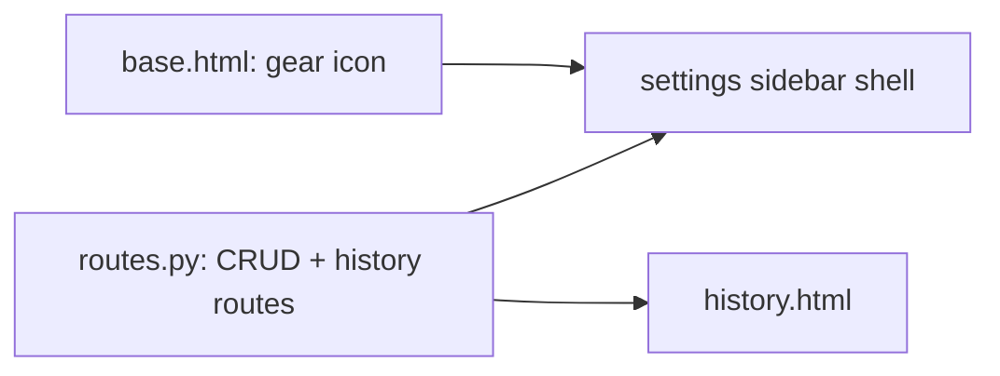

# Horizontal Plan: settings-and-transparency

## Layers touched

| Layer | Files | Change |
|---|---|---|
| **Config read/write** | `src/cleanup_tools/config.py` | No schema change — `bucket_rules`/`search_roots`/`master_paths` already exist; this epic adds UI on top of `load_config`/`save_config`, already tested. |
| **Backend/API** | `src/cleanup_tools/ui/routes.py` | New CRUD routes per settings section (`/settings/bucket-rules`, `/settings/search-roots`, `/settings/master-paths`, each GET+POST following the existing `/settings/icon` pattern), a read-only `/settings/advanced` (JSON dump of `config.yaml`), and a new `/history` route aggregating `QueueEntry.status_history` across all entries, paginated (reuse `_paginate` from `queue_view` — already exists, already tested). |
| **UI** | `base.html` (nav gear icon, chosen: Option A — bare icon, no label), new `settings-shell.html`-style sidebar layout wrapping the existing `settings.html` content, `history.html` (new template) | Sidebar-of-sections shell; icon-picker section becomes one pane within it, unchanged internally. |

## Cross-layer dependencies

The gear-icon nav change is trivially independent of everything else and can land first as a visible, low-risk win. CRUD routes and the history-aggregation route are independent of each other (different data, no shared new code) and can be built in parallel.

## Risk concentration

Per the design discussion: the `master_paths.backed_up` toggle's safety-critical copy, bucket-rule reorder correctness (first-match-wins), and the History view's `executed_at`-gated Undo are where real risk sits — not the CRUD plumbing itself, which is mechanical once `/settings/icon` already proved the pattern.
