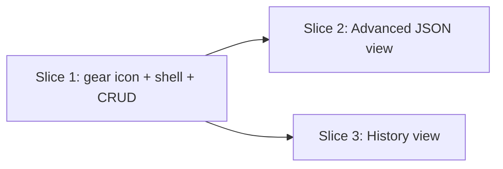

# Vertical Plan: settings-and-transparency

Three slices, each landing in a working state before the next begins.

## Slice 1 — Gear icon + settings sidebar shell + core CRUD

**What ships:** the nav gear icon (Option A — bare icon, no label, confirmed by product owner), the sidebar-of-sections shell (General / App Icon / Bucket Rules / Search Roots & Locations / Master Paths / AI Provider), and full CRUD for bucket rules (add/edit/remove/reorder via up/down buttons — no drag-and-drop, per the design discussion's explicit recommendation), search roots (add/remove), and master paths (add/remove, `backed_up` toggle with explicit warning copy on true→false). The existing icon-picker becomes one pane in the shell, functionally unchanged.

**Working-state proof:** `test_ui_routes.py` coverage per new CRUD route (mirroring the existing `/settings/icon` test pattern); manual click-through of the full sidebar.

## Slice 2 — Advanced (read-only config JSON view)

**What ships:** one `Advanced` pane, read-only JSON dump of the effective `config.yaml`. Editable-in-place is explicitly out of scope for this epic (design discussion open question 1) — a clean, separately-plannable fast-follow if wanted later.

**Working-state proof:** route test confirming the JSON view reflects `load_config`'s actual output.

## Slice 3 — History view

**What ships:** the paginated, reverse-chronological feed aggregating `status_history` across all queue entries, with per-row Undo strictly gated on `entry.executed_at` (unexecuted → real, working Undo button calling the existing `queue.undo()`; executed → explicit "already happened on disk" copy, no button that implies a filesystem reversal).

**Working-state proof:** tests covering both the executed and not-yet-executed row-rendering paths explicitly (this is the epic's single highest-risk correctness property per the design discussion — needs its own dedicated test, not incidental coverage), plus pagination behavior at a realistic entry count.

## Dependency graph

Slices 2 and 3 both need slice 1's sidebar shell to exist (they're panes within it) but are independent of each other and can be built in parallel once slice 1 lands.
